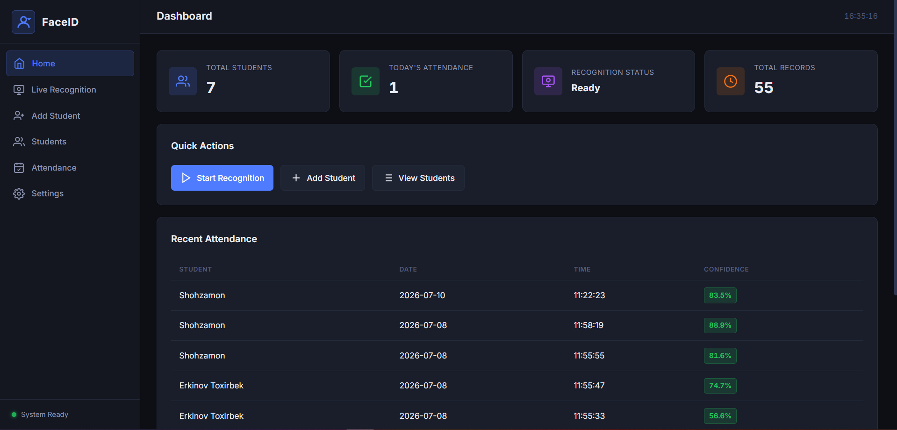
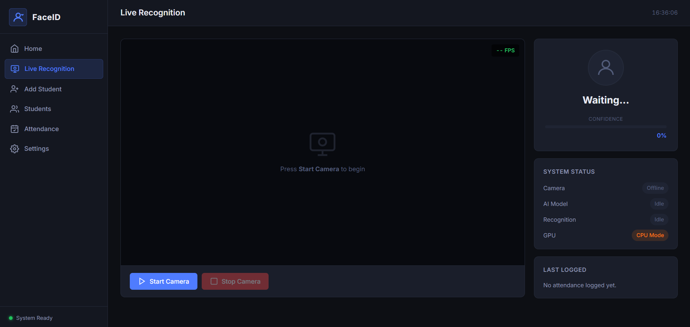
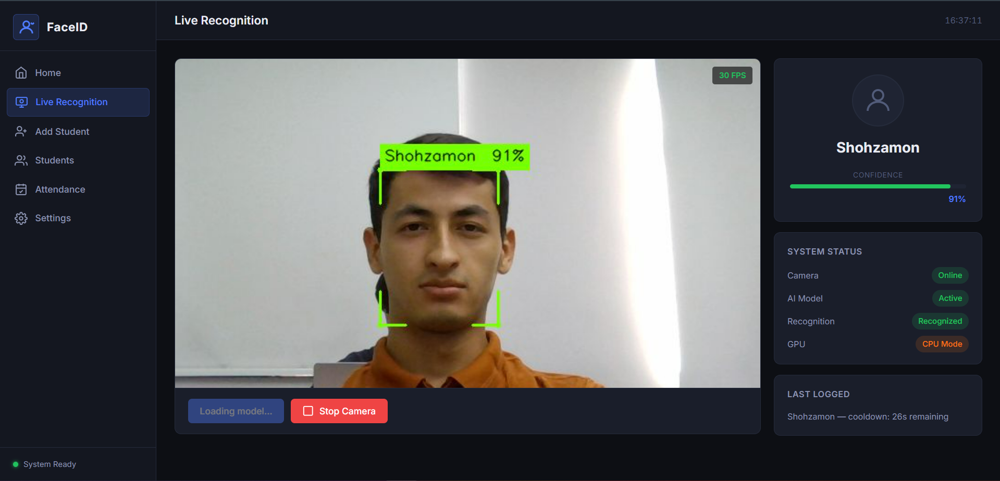
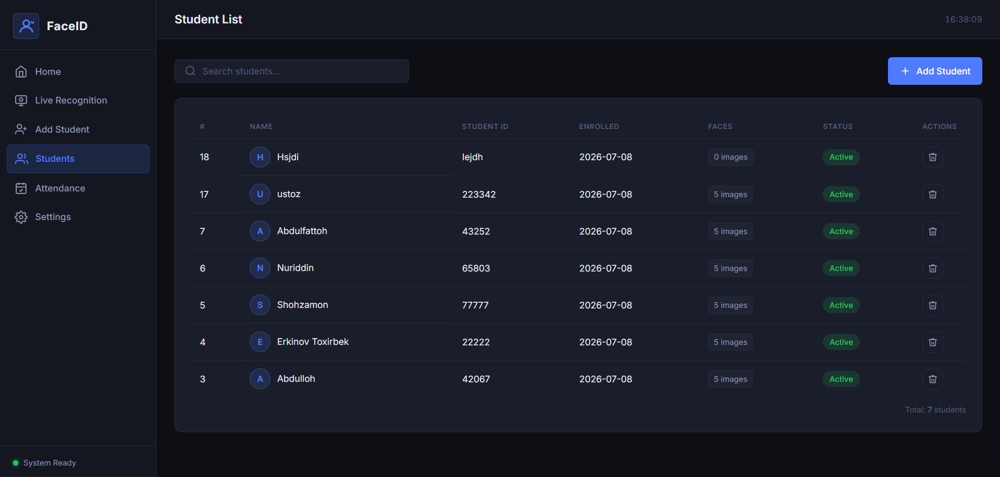

<div align="center">

# FaceID Attendance

**Real-time yuz tanish orqali aqlli davomat tizimi**

Veb-kamera yordamida talabalarni aniqlaydi, ismini ko'rsatadi va davomatni avtomatik yozadi.

<br/>


<br/>

[Tizim ko'rinishi](#-tizim-ko'rinishi) ·
[Imkoniyatlar](#-imkoniyatlar) ·
[Tez boshlash](#-tez-boshlash) ·
[Sozlamalar](#%EF%B8%8F-sozlamalar) ·
[API](#-api-endpointlar)

</div>

---

## 📸 Tizim ko'rinishi

FaceID Attendance zamonaviy **qorong'u mavzu** (dark theme) bilan ishlaydigan veb-interfeysga ega. Chap tomonda doimiy navigatsiya paneli, o'ng tomonda esa asosiy kontent joylashgan. Barcha sahifalar bir xil dizayn tizimida — toza, professional va foydalanish uchun qulay.

### Asosiy ekran — Dashboard

Bosh sahifada tizim holati bir nazar ko'rinadi: jami talabalar soni, bugungi davomat, tanish tizimi holati va umumiy yozuvlar. Tez harakatlar tugmalari orqali jonli tanishni boshlash, yangi talaba qo'shish yoki ro'yxatni ko'rish mumkin. Pastki qismda oxirgi davomat jadvali — talaba ismi, sana, vaqt va ishonch foizi ko'rsatiladi.



---

### Jonli tanish — kamera kutish holati

Live Recognition sahifasida markazda kamera oqimi, o'ng tomonda esa tanish natijasi va tizim holati paneli joylashgan. Kamera yoqilmaguncha qora ekran va "Press Start Camera to begin" yozuvi chiqadi. O'ng panelda kamera, AI model, tanish va GPU/CPU holati real vaqtda yangilanadi.



---

### Jonli tanish — talaba aniqlangan

Kamera yoqilgach, yuz atrofida **yashil ramka** paydo bo'ladi va talaba ismi bilan ishonch foizi (masalan, `Shohzamon 91%`) ko'rsatiladi. FPS hisoblagich o'ng yuqori burchakda, tanish natijasi va cooldown vaqti o'ng panelda aks etadi. Tanish muvaffaqiyatli bo'lganda davomat avtomatik yoziladi.



---

### Talabalar ro'yxati

Barcha ro'yxatdan o'tgan talabalar jadval ko'rinishida: avatar, ism, talaba ID, ro'yxatdan o'tish sanasi, saqlangan yuz suratlari soni (5 ta) va holat (Active). Qidiruv maydoni va "+ Add Student" tugmasi yuqori qismda. Har bir talabani o'chirish imkoniyati ham mavjud.



---

## ✨ Imkoniyatlar

| | Funksiya | Tavsif |
|:---:|:---|:---|
| 🎥 | **Jonli tanish** | Veb-kamera orqali real vaqtda yuz aniqlash va talabani tanish |
| ✅ | **Davomat yozish** | Tanilgan talaba uchun avtomatik davomat + cooldown himoyasi |
| 👤 | **Talaba qo'shish** | 5 burchakdan yuz surati (kamera yoki fayl orqali) |
| 🧠 | **Embedding** | ArcFace modeli bilan 512-o'lchamli yuz vektori |
| 📊 | **Dashboard** | Statistika, talabalar ro'yxati, davomat tarixi |
| ⚡ | **GPU / CPU** | NVIDIA GPU (CUDA) yoki CPU rejimi |

---

## ⚙️ Qanday ishlaydi

```
Veb-kamera kadr
      │
      ▼
Yuz aniqlash (SCRFD)
      │
      ▼
Yuzni tekislash (5 nuqta landmark)
      │
      ▼
Embedding (ArcFace → 512 vektor)
      │
      ▼
Cosine similarity solishtirish
      │
      ▼
Natija: Talaba ismi yoki "Stranger"
```

---

## 🛠 Texnologiyalar

<table>
  <tr>
    <th>Qatlam</th>
    <th>Texnologiya</th>
  </tr>
  <tr>
    <td>Backend</td>
    <td>Python 3.11 · FastAPI · Uvicorn</td>
  </tr>
  <tr>
    <td>Frontend</td>
    <td>HTML · CSS · JavaScript · Jinja2</td>
  </tr>
  <tr>
    <td>Ma'lumotlar bazasi</td>
    <td>PostgreSQL 14+ · SQLAlchemy 2.0 (async) · asyncpg</td>
  </tr>
  <tr>
    <td>Yuz aniqlash</td>
    <td>InsightFace SCRFD</td>
  </tr>
  <tr>
    <td>Yuz tanish</td>
    <td>InsightFace ArcFace (<code>buffalo_l</code>)</td>
  </tr>
  <tr>
    <td>Inference</td>
    <td>ONNX Runtime (CPU / GPU)</td>
  </tr>
  <tr>
    <td>Tasvir ishlash</td>
    <td>OpenCV · Pillow</td>
  </tr>
</table>

> **Python 3.11.x** tavsiya etiladi. Python 3.12+ ba'zi CV kutubxonalari bilan muammo berishi mumkin.

---

## 🚀 Tez boshlash (Windows)

### 1. Talablar

- [Python 3.11](https://www.python.org/downloads/release/python-3119/) — **"Add Python to PATH"** belgilang
- [PostgreSQL 14+](https://www.postgresql.org/download/windows/)
- Veb-kamera (laptop yoki USB)

### 2. Ma'lumotlar bazasini yaratish

PostgreSQL da:

```sql
CREATE DATABASE face_attendance;
```

### 3. Loyihani o'rnatish

```powershell
cd C:\path\to\FaceIdCursor

# Virtual muhit
python -m venv .venv
.venv\Scripts\Activate.ps1

# Agar xato chiqsa:
# Set-ExecutionPolicy -Scope CurrentUser -ExecutionPolicy RemoteSigned

# Kutubxonalar
pip install -r requirements.txt

# Sozlamalar
copy .env.example .env
# .env faylini tahrirlang (DATABASE_URL, SECRET_KEY va boshqalar)
```

### 4. Serverni ishga tushirish

```powershell
.\run.ps1
```

Brauzerda oching: **http://localhost:8000**

---

## 📁 Loyiha tuzilmasi

```
FaceIdCursor/
├── app/
│   ├── api/routes/       # API va sahifa marshrutlari
│   ├── core/             # Sozlamalar, logging
│   ├── database/         # DB ulanish, migratsiyalar
│   ├── enrollment/       # Talaba ro'yxatdan o'tkazish
│   ├── recognition/      # Kamera, detection, embedding, matching
│   ├── services/         # Biznes logika
│   ├── static/           # CSS, JavaScript
│   └── templates/        # HTML shablonlar
├── interface_images/     # Interfeys skrinshotlari (README uchun)
├── face_data/
│   ├── images/           # Yuz suratlari (gitignore)
│   └── embeddings/       # Embedding fayllari (gitignore)
├── logs/                 # Ilova loglari (gitignore)
├── .env.example
├── requirements.txt
├── run.ps1               # HTTP server
└── stop_servers.ps1      # Port 8000 ni tozalash
```

---

## ⚙️ Sozlamalar (.env)

| O'zgaruvchi | Tavsif | Standart |
|-------------|--------|----------|
| `APP_HOST` | Server host | `127.0.0.1` |
| `APP_PORT` | Port | `8000` |
| `DATABASE_URL` | PostgreSQL ulanish | — |
| `RECOGNITION_THRESHOLD` | Tanish chegarasi (0–1). Yuqori = qattiqroq | `0.45` |
| `USE_GPU` | GPU yoqish | `False` |
| `ATTENDANCE_COOLDOWN_SECONDS` | Qayta yozish vaqti (soniya) | `30` |

Birinchi ishga tushirishda InsightFace modellari avtomatik yuklanadi (~270 MB).

---

## 🎮 GPU qo'llab-quvvatlash (ixtiyoriy)

NVIDIA GPU + CUDA 11.8 yoki 12.x bo'lsa:

```powershell
pip uninstall onnxruntime
pip install onnxruntime-gpu==1.18.0
```

`.env` da: `USE_GPU=True`

GPU bo'lmasa tizim avtomatik CPU rejimida ishlaydi (~15–20 FPS).

---

## 📡 API endpointlar

| Endpoint | Vazifa |
|----------|--------|
| `POST /api/stream/start` | Kamerani yoqish |
| `GET /api/stream/feed` | Jonli MJPEG video |
| `GET /api/stream/status` | FPS, tanish natijasi |
| `POST /api/stream/stop` | Kamerani o'chirish |
| `POST /api/enroll/student` | Yangi talaba yaratish |
| `POST /api/enroll/capture/{id}/{angle}` | Burchakdan surat olish |
| `GET /api/attendance/last` | Oxirgi davomat |

To'liq API hujjati: `http://localhost:8000/docs` (`DEBUG=True` bo'lganda)

---

## 🔧 Muammolarni hal qilish

| Muammo | Yechim |
|--------|--------|
| Port 8000 band | `.\stop_servers.ps1` ishga tushiring |
| Kamera ochilmaydi | Boshqa dastur kamerani band qilmaganini tekshiring |
| Model yuklanmaydi | Internet ulanishi va ~270 MB bo'sh joy |
| Tanish ishlamaydi | Talaba 5 burchakdan ro'yxatdan o'tkazilganini tekshiring |

---

## 📤 GitHub ga yuklash

Loyiha GitHub uchun tayyorlangan:

```powershell
cd C:\path\to\FaceIdCursor

git init
git add .
git status          # .env va face_data yuklanmasligini tekshiring
git commit -m "Initial commit: FaceID Attendance System"

git remote add origin https://github.com/<username>/FaceIdCursor.git
git branch -M main
git push -u origin main
```

**Gitignore** — quyidagilar hech qachon yuklanmaydi:

- `.env` — parollar va maxfiy kalitlar
- `.venv/` — virtual muhit
- `face_data/` — yuz suratlari va embeddinglar
- `logs/` — log fayllar

---

## 📄 Litsenziya

Shaxsiy / ta'lim loyihasi. Erkin foydalaning va o'zgartiring.

---

<div align="center">

**FaceID Attendance** — yuz tanish orqali aqlli davomat tizimi

</div>
